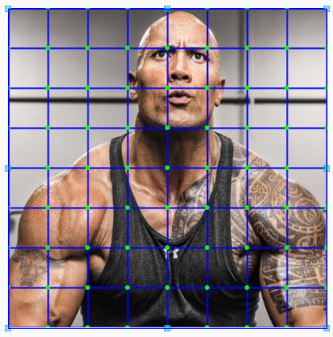

[](http://www.repostatus.org/#active)

WobbleImageView
=============
An Imageview with an easy Wobble/Mesh-Warp  capability.

## Quick Start

> **GRADLE**

```xml
   dependencies {
        implementation 'com.github.54LiNKeR:WobbleImageView:2.0.0'
    }
```

> **XML**

**1. Cr8ting The Mesh**

by default this is how create a new mesh over the ImageView



```xml
   <linkersoft.blackpanther.wobble.WobbleMeshImageView
       android:layout_width="200dp"
       android:layout_height="200dp"
       android:layout_gravity="center"
       android:id="@+id/wobbler"
       android:src="@drawable/dwayne_mesh"
       app:wobbleRows="8"
       app:wobbleColumns="8"
       app:drawMeshGrid="true"
       />
```

if you like you could load a custom wobble-mesh via the wobble attribute `app:wobble` i.e. `app:wobble=@drawable/your-wobble-mask` but
your-wobble-mask must be a bitmap in which each row of your mesh is a different color in terms of pixels to the another e.g.


also if your-wobble-mask's dimension is not the same as your ImageView's dimension the mesh is scaled to fit the
ImageView.

**2. Warping The Mesh**

This is done via the wobble attribute `app:wobble` and there are three ways to warp the ImageView namely:


   | Reference| Warping | Syntax | Example |
   |----------|---------|--------|---------|
   | dwayne0 | by Shifting the rows | `app:wobble=[r]rowIndex#(xShift,yShift)` | **[r]2#(5,-20)**|
   | dwayne1| by Shifting the columns | `app:wobble=[c]columnIndex#(xShift,yShift)` | **[c]2#(0,10)**|
   | dwayne2 | by Shifting any node | `app:wobble=[r|c]rowIndex,columnIndex#(xShift,yShift)` | **[r\|c]1,2#(8,15)**|

in order to Shift multiple rows/columns/nodes at the same time here's how

- by Shifting the rows
   - `app:wobble=[r#extra-rowIndices]rowIndex#(xShift,yShift)` e.g. **[r#2]2#(5,-20)**
- by Shifting the columns
   - `app:wobble=[c#extra-columnIndices]columnIndex#(xShift,yShift)` e.g. **[c#-2]6#(0,10)** (*the minus indicates direction i.e. 2 columns above the supposed*)
- by Shifting any node
   - `app:wobble=[r|c#extra-nodes]rowIndex,columnIndex#(xShift,yShift)` e.g. **[r\|c#r2]1,2#(8,15)**,**[r\|c#c3]1,2#(8,15)** (*r2 = 2 extra nodes along corresponding row, c3 = 3 extra nodes along corresponding column*)

       - **Examples**
            - Given you have

       ```xml
          <linkersoft.blackpanther.wobble.WobbleMeshImageView
              android:layout_width="200dp"
              android:layout_height="200dp"
              android:layout_gravity="center"
              android:id="@+id/wobbler"
              android:src="@drawable/dwayne_mesh"
              app:wobbleRows="8"
              app:wobbleColumns="8"
              app:wobble="..."
              app:drawMeshGrid="true"
              />
       ```

   | Reference | `app:wobble` | Result |
   |----------|---------|--------|
   | dwayne0 | [r]2#(5,-20) |  |
   | dwayne1 | [c]2#(0,10) |  |
   | dwayne2 | [r\|c]1,2#(8,15) |  |
   | dwayne0+dwayne2+dwayne2 | [r]2#(5,-20)~[c]2#(0,10)~[r\|c]1,2#(8,15) |  |


> **JAVA**

  ```java
  
  public class wobble extends AppCompatActivity {

    WobbleMeshImageView woah;
    @Override
    protected void onCreate(Bundle savedInstanceState) {
        super.onCreate(savedInstanceState);
        setContentView(R.layout.wobble);
        woah=(WobbleMeshImageView)findViewById(R.id.wobbler);
        woah.setOnClickListener(new View.OnClickListener() {
            @Override
            public void onClick(View v) {
                  ((WobbleMeshImageView)v).setWobbleMesh(woah.getWobbleWidth(),woah.getWobbleHeight(),R.drawable.wobble_mask1,null);
            }
        });

    }


}
  
  ```
> public-methods

> `setWobbleMesh(int WobbleWidth,int WobbleHeight,float[] wobbleVerts,String Wobble)`

> `setWobbleMesh(int WobbleWidth,int WobbleHeight,Bitmap WobbleMaskBitmap,String Wobble)`

> `getWobbleWidth()`

> `getWobbleHeight()`

> `setWobbleMask(int ResId)`

> `getWobbleMesh()`

> `getWobbleMask()`

> `getWobble()`
